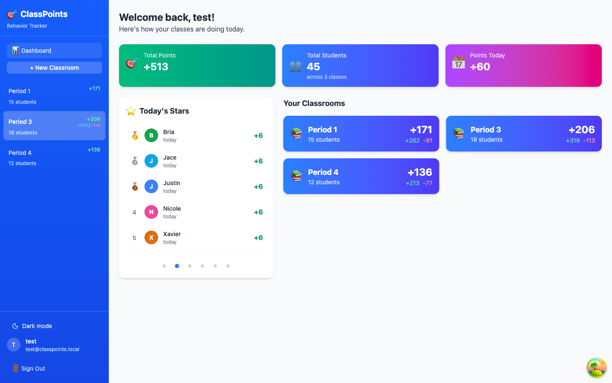
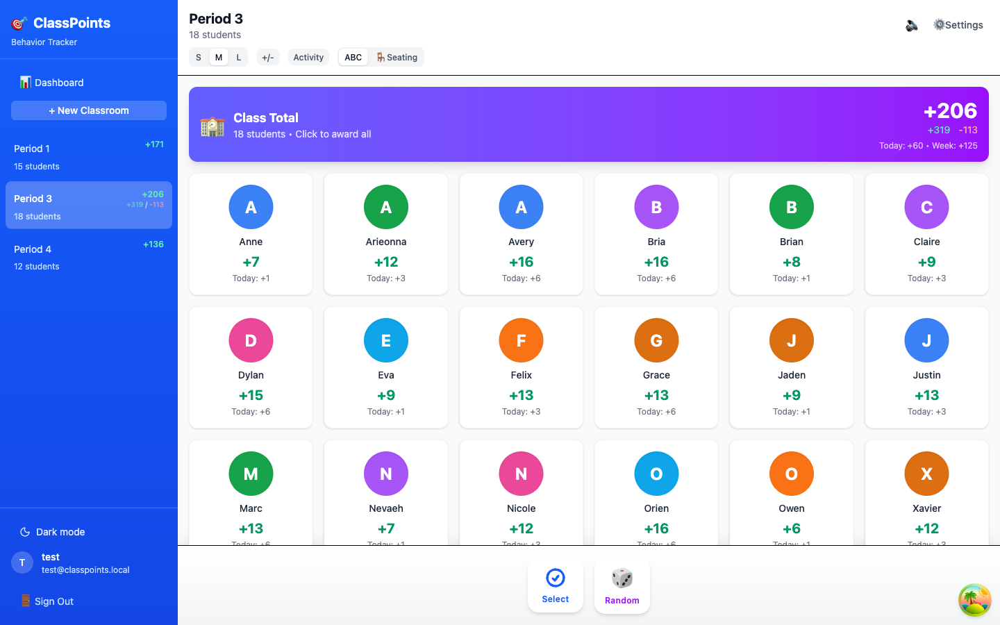
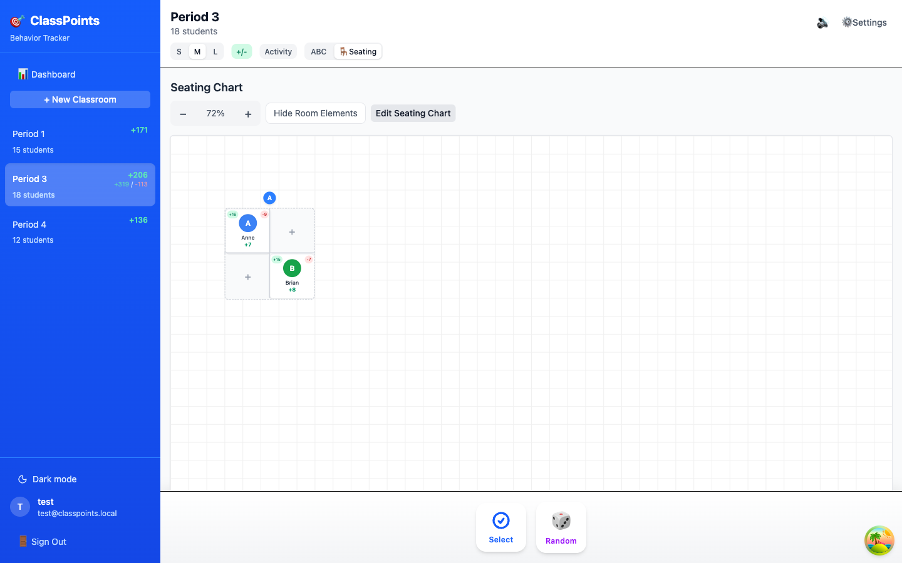

# ClassPoints

> A real-time classroom behavior tracker and points system for teachers.

[](https://github.com/Sallvainian/ClassPoints/actions/workflows/test.yml)
[](https://github.com/Sallvainian/ClassPoints/actions/workflows/deploy.yml)
[](LICENSE.md)

ClassPoints lets a teacher run their whole classroom economy from one screen: award or deduct points for behaviors, see live totals for today and this week, arrange students on a drag-and-drop seating chart, and have every change sync in real time across devices. It runs as a web app and wraps into native iOS and Android apps via Capacitor, tuned iPad-first for touch.

**Live app:** <https://sallvainian.github.io/ClassPoints/>

| Home dashboard                                                     | Class view                                                         | Seating chart                                                    |
| ------------------------------------------------------------------ | ------------------------------------------------------------------ | ---------------------------------------------------------------- |
|  |  |  |

## Features

- **Point awards at three scopes** — a single student, a multi-selected subset, or the whole class at once, with sound and haptic feedback split by positive/negative behavior.
- **15 default behaviors** (8 positive, 7 negative, from "On Task" +1 to "Insubordination" −5), shared across all classrooms and grouped in the picker under _Positive_ and _Needs work_.
- **10-second undo** for any award — including entire class-wide or multi-select batches.
- **Live dashboards** — home view with total points, total students, points today, and a leaderboard that rotates through six categories (Top Points Overall, Today's Stars, Class Champions, This Week Leaders, Best Behaved, Rising Stars).
- **Seating charts** — a touch-first editor for table groups and room elements (teacher desk, door, window, counter, sink) with drag, rotate, resize, snap-to-grid, table locking, student randomization, zoom, and named layout presets. Touch drags use press-and-hold so swipes still scroll, and auto-fit never shrinks seats below 44 px touch targets.
- **Roster management** — add students one at a time or bulk-import from JSON/CSV/TXT (drag-and-drop or paste), rename, adjust totals, reset points, or delete.
- **Real-time sync** — Supabase Realtime pushes every change to all connected devices; reconnects trigger catch-up refetches so nothing is silently missed.
- **Account self-service** — display name, email change via confirmation link, password change, per-user sound settings synced across devices, dark/light theme, and full in-app account deletion (App Store Guideline 5.1.1(v)).
- **Random student picker**, activity feed of recent transactions, card-size controls, and a one-time migration wizard that lifts legacy localStorage data into Supabase.

## Tech stack

| Layer        | Choice                                                                                                                   |
| ------------ | ------------------------------------------------------------------------------------------------------------------------ |
| UI           | React 19, TypeScript, Tailwind CSS v4 (CSS-first config), lucide-react                                                   |
| Server state | TanStack Query v5 (single QueryClient, centralized query keys — see [ADR-005](docs/adr/ADR-005-queryclient-defaults.md)) |
| Drag & drop  | @dnd-kit                                                                                                                 |
| Backend      | Supabase (Postgres 17, Realtime, Auth, one Edge Function) via supabase-js v2                                             |
| Validation   | Zod v4 at the JSONB read boundary (layout presets)                                                                       |
| Native shell | Capacitor 8 (iOS + Android)                                                                                              |
| Build / test | Vite, Vitest, Playwright, ESLint, Prettier                                                                               |
| Fonts        | Self-hosted via @fontsource (Instrument Serif, Geist, JetBrains Mono) — no CDN, offline first paint                      |

### Architecture highlights

- **RLS on every table with owner-scoped policies** keyed on `auth.uid()` — students and transactions inherit ownership through their classroom; the one deliberate exception is the shared default-behavior rows (`user_id NULL`), readable by everyone.
- **Denormalized lifetime totals** on `students`, kept current by a Postgres trigger; today/this-week totals come from a single batched RPC per load, and RPC failure degrades to zeros instead of failing the roster.
- **Atomic writes where it matters** — batch awards are all-or-nothing with a lost-ack recovery probe (re-query by `batch_id` on ambiguous failures), and the multi-write seating operations (assign, swap, randomize, apply preset) run as single-transaction plpgsql RPCs so partial seat state can never persist.
- **Realtime strategy is invalidate-and-refetch**, not payload merging — realtime events invalidate the TanStack Query cache and refetch.
- **Auth resilience** — transient/network-class auth failures (school content filters, flaky Wi-Fi, 5xx) never destroy the session; on native, the session lives in Capacitor Preferences because WKWebView localStorage can be evicted under storage pressure.
- **Account deletion** runs through a `delete-account` Edge Function whose target identity comes exclusively from the verified JWT — never the request body.

The app is realtime-only by design: there is no offline mutation queue, just clear network-status feedback and reconnect catch-up.

## Getting started

### Prerequisites

- **Node 25+** (`.nvmrc` / `engines`)
- **Docker daemon** — required for the local Supabase stack
- **Supabase CLI** — installed globally (e.g. `brew install supabase/tap/supabase`)
- **mise + fnox + an age private key** — only for hosted-Supabase workflows (`dev:hosted`, `build`, `preview`, `cap:build`, `migrate`); local development does not need them

### Local development (default)

Local-by-default: `npm run dev` runs against a local Supabase stack, not production.

```bash
npm install
npm run supabase:up          # first run: boots the local stack and prints its keys
cp .env.test.example .env.test   # paste the anon + service-role keys from `supabase status`
npm run dev                  # http://localhost:5173
```

`npm run dev` wraps Vite in `scripts/dev.mjs`, which auto-starts the local Supabase stack if it's down (and stops it on exit only if it was the one that started it), health-checks the stack over HTTP, and on macOS will even start your Docker provider (OrbStack → Docker Desktop → Colima). If the stack is already running, it leaves it alone. `npm run dev:host` does the same exposed on your LAN.

### Hosted mode

`npm run dev:hosted` targets the hosted Supabase project. Secrets live age-encrypted in `fnox.toml` and are injected by `fnox exec --`; you need the matching age private key to decrypt them.

### Common commands

```bash
npm run dev            # dev server, local Supabase (auto-managed)
npm run dev:hosted     # dev server against hosted Supabase (fnox)
npm run build          # tsc + production build (fnox)
npm run lint           # ESLint
npm run typecheck      # tsc over app + tests
npm run check:bundle   # assert prod bundle contains no react-query-devtools
npm test               # unit/component tests (Vitest, watch)
npm run test:integration  # backend integration tests against local Supabase
npm run test:e2e       # Playwright E2E (auto-starts/seeds/stops local stack)
npm run supabase:up    # explicit local stack lifecycle
npm run supabase:down
```

## Testing

Three layers, each with its own runner config:

- **Unit / component** — Vitest + Testing Library in jsdom (`src/test/` plus colocated `__tests__/` and `*.test.*` files throughout `src/`). These mock Supabase at the module boundary and need no stack or credentials.
- **Integration** — a separate Vitest config (`tests/integration/`) runs against a real local Supabase stack, organized by concern (RLS, realtime, schema, transactions, seating, functions). Files run serially because they share one stack.
- **E2E** — Playwright (`tests/e2e/`) with four projects: auth setup, desktop Chromium, a mobile viewport, and an iPad viewport for seating touch flows. Global setup boots and seeds the local stack; teardown stops it only if setup started it.

The test configs **fail closed**: both Playwright and the integration runner parse the Supabase URL and refuse to run unless the host is loopback, RFC1918, or Tailscale CGNAT — and they force-override shell env from `.env.test` so a leaked hosted session can never point tests at production.

CI (`test.yml`) runs lint, a bundle dead-code check, unit, integration, E2E sharded 4 ways, and a 10-iteration burn-in job for flake detection. On push to `main`, `deploy.yml` lints, typechecks, runs unit tests, builds, and deploys to GitHub Pages.

## Native builds (Capacitor)

```bash
npm run cap:build      # tsc + vite build --mode capacitor + bundle check + cap sync
npm run cap:open:ios   # open the Xcode project
npm run cap:run:ios    # build & run on an iOS device/simulator
npm run cap:assets     # regenerate icons + splash screens from resources/
```

The Capacitor build uses a relative base path (the web build deploys under `/ClassPoints/`) and locks the WebView viewport against pinch/focus zoom. Native niceties — status-bar theme sync, splash handoff, Android back-button handling, award haptics — are all no-ops on web and fire-and-forget on native, so a bridge failure can never break the app. For live reload against the native shell, point `CAP_SERVER_URL` at a LAN Vite dev server before `cap sync`.

## Project structure

```
src/
  components/   # feature UI: dashboard, seating, points, settings, auth, profile, home
  hooks/        # TanStack Query data hooks + UI hooks (awards, undo, realtime, seating)
  contexts/     # App / Auth / Sound / Theme providers
  lib/          # supabase client, queryClient, query keys, native shell, haptics
  services/     # NetworkStatus
  types/        # generated DB types, DB→app transforms, zod schemas
  utils/        # defaults (seed behaviors), helpers
supabase/
  migrations/   # schema, RLS policies, triggers, RPCs
  functions/    # delete-account Edge Function
scripts/        # dev wrapper, local-stack lifecycle, bundle check, test seeding
tests/          # integration + e2e suites
docs/           # architecture docs, development guide, ADRs, screenshots
```

More depth in [docs/index.md](docs/index.md), [docs/architecture.md](docs/architecture.md), and [docs/development-guide.md](docs/development-guide.md).

## License

ClassPoints is licensed under the [PolyForm Noncommercial License 1.0.0](LICENSE.md): you're free to use, modify, and share it for any noncommercial purpose. Schools, charities, and other noncommercial organizations are explicitly covered, and any other noncommercial use — including a teacher's personal use — is permitted. Commercial use is not.

> Required Notice: Copyright (c) 2026 Frank Cottone (Sallvainian) (https://github.com/Sallvainian/ClassPoints)
