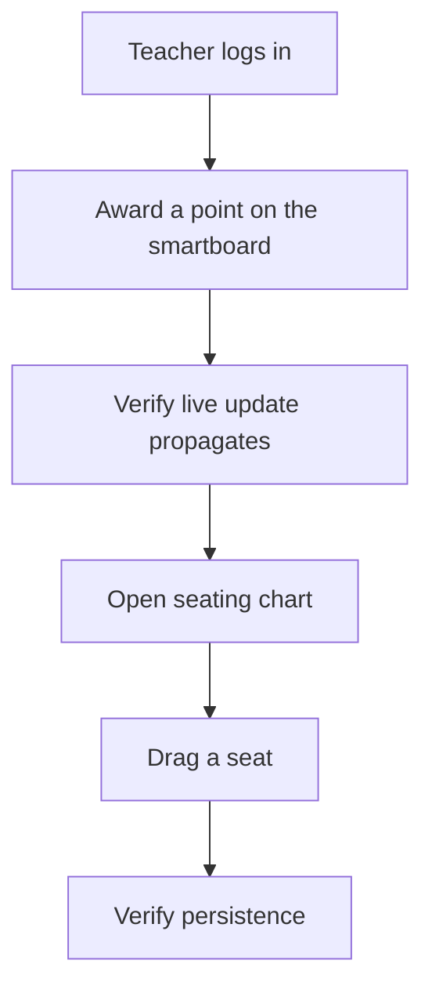

# UX Design Specification — ClassPoints

**Author:** Sallvain
**Date:** 2026-04-27
**Branch at synthesis time:** `redesign/editorial-engineering` (HEAD `d652260`, 5 commits ahead of `main`)

---

## How to read this document

This was reverse-engineered from artifacts (shipped code + planning artifacts + session transcripts), not produced through an interactive `bmad-create-ux-design` workflow. Every factual claim is followed by a parenthetical citation pointing to the source. Direct user quotes are marked as such. Sections marked `GAP` are content the workflow normally elicits in conversation that I could not source — they are intentionally blank, not placeholders for an LLM to fill in.

---

## Executive Summary

### Project Vision

ClassPoints is a classroom behavior-point management web app: a teacher tracks student behavior points with a teacher-workstation UI, with realtime sync to a student-facing smartboard live display.

> Domain: EdTech — classroom behavior-point management with a teacher workstation UI and student-facing smartboard live display.
>
> — `_bmad-output/planning-artifacts/prd.md`, line 92

The redesign on `redesign/editorial-engineering` (Phase 1 commit `ae7a9a8` + Phase 2 commit `fb3f239`, both 2026-04-27) replaces the prior aesthetic with what the agent named "editorial / engineering": editorial typography, hairline borders, terracotta accent, dot-grid moments. See **Design Direction Decision** below for the full directive and direction quotes.

### Stakeholder Framing (in their own words)

User stating the project's animating goal during PRD creation (session `2d74936c`, 2026-04-21, voice transcript via whisper STT):

> The problem statement, I mean, yes, that would apply to the reason why, but really it's just because I want to develop it and I want to improve it over time and I can't do that with shitty patterns.

This is the framing for the broader modernization effort. The redesign on top is consistent with it: a clean foundation, primitives + tokens that cascade, no visual band-aids.

### Target Users

Two user roles surface in the planning artifacts and architecture session worked examples.

**1. The teacher** — primary end-user. Concretely characterized in the architecture-session worked example (`ad2ab650`, 2026-04-23 reasoning passage; persona name "Ms. Rivera" introduced as a worked example, not a formal persona artifact):

> Ms. Rivera is teaching 4th-grade math. She has ClassPoints open on her laptop (docked, projector mirror) and her iPhone in her back pocket — standard multi-device teacher pattern.

Multi-teacher scenario also surfaces (same session):

> shared iPad in the teacher's lounge — two teachers, browser profile not switched, one uses Google account chooser to re-auth.

This makes "user-id transition cache clear" load-bearing — there are real teachers using shared devices.

**2. Students** — they don't use the app directly, but they see it on the smartboard:

> seating chart changes are meant to be visible live (student-facing smartboard use case: teacher rearranges seats → students see it update).
>
> — `docs/modernization-plan.md`, line 308

> Sophia flickers 32→31→32 on the projector in front of 25 fourth-graders.
>
> — session `ad2ab650`, architecture worked-example

The student-facing read of the smartboard is why optimistic-update glitches are not just developer hygiene — they're publicly visible to a class.

**The contributor (Sallvain himself)** is documented in the PRD as an additional persona-of-development, not an end-user. (`prd.md` lines 162-168.) Out of scope for this UX doc.

### Key Design Challenges

Sourced from the architecture session's worked-example reasoning (`ad2ab650`) and the PRD's domain framing:

1. **Multi-device concurrency on a public display.** A teacher walks the room with a phone while the projector mirrors a laptop. Optimistic writes from one device must reconcile with realtime broadcasts and reads on the other without flickering — flickers are visible to the class.
2. **Mid-class network flap.** Architecture session models "school Wi-Fi hiccups — her phone's cellular takes 900ms to fall over." Award-on-phone-while-Wi-Fi-flaps must not lose the award.
3. **Cross-device undo.** "Cross-device undo; DELETE branch decrements time totals" (`project-context.md` UI rules realtime-scope table). Undo on phone must propagate to laptop within ~1s.
4. **Multi-teacher account hand-off on shared devices.** Shared iPad in the lounge → two teachers, account chooser → new user-id must clear the prior teacher's cache before first render to avoid flashing the wrong roster.
5. **Cascade-without-rewrite for the redesign.** 45 components across 12 folders existed pre-redesign; full hand-redesign of every file was rejected as too risky in the agent's Phase 1 proposal (session `f77e599e`, 09:23). Solution shipped: tokens + primitives + 4 hand-redesigned surfaces; rest cascade via Tailwind alias of `blue-*`/`indigo-*`/`purple-*` → terracotta (`index.css:44-71`).

### Design Opportunities

[INFERRED — no explicit "opportunity" elicitation occurred. Marking GAP rather than fabricating.]

**GAP**

---

## Core User Experience

### Defining Experience

> Smartboard reflects phone awards within ~1s.
>
> — `_bmad-output/project-context.md` UI rules section, realtime scope table (line 78)

The defining loop is: tap on phone → optimistic update on phone → realtime broadcast → smartboard reflects within ~1s → undo toast on phone, undoable cross-device for ~5s.

This is the core capability the modernization PRD is built around (PRD §FR5 three-channel realtime rule, lines 122 area; `prd.md` smoke flow line 321).

### Platform Strategy

**Verified facts** (from source + planning artifacts):

- Web app, no native (`package.json` — React 18 SPA, Vite build).
- Class-based dark mode (`src/index.css:4`, `index.html:15-26`).
- Tailwind defaults for breakpoints; custom `lg:grid-cols-[1.05fr_1fr]` only on auth (`AuthPage.tsx:12`).

**Real-world device combinations** (architecture session worked examples, `ad2ab650`):

- **Laptop docked + projector mirror** (the smartboard) + **iPhone in pocket** (mobile awards). This is described as "standard multi-device teacher pattern."
- **Shared iPad in the teacher's lounge** with multi-teacher account chooser flow.
- **Chromebook** referenced as a Wi-Fi-flap context: `refetchOnReconnect: 'always'` is justified by "Chromebook wifi flap."

**Stakeholder commitments beyond what's documented (offline policy, PWA, formal device support matrix)** — **GAP**.

### Effortless Interactions

Sourced from the realtime-scope table in project-context (`project-context.md` lines 73-83):

- **Award (phone)** — must reflect on smartboard within ~1s. Realtime is the mechanism.
- **Undo** — works cross-device via `point_transactions` DELETE event with `REPLICA IDENTITY FULL` (`project-context.md` line 93).
- **Drag a seat (laptop)** — students see the rearrange live on smartboard.

These are the realtime-required domains. Everything else (classroom list, behaviors, layout presets, user settings) is **explicitly non-realtime** (`project-context.md` line 81) — no over-eager push for things that don't benefit from it.

### Critical Success Moments

The PRD documents one canonical manual smoke flow:

> Manual smoke: teacher login → award a point on the smartboard → verify live update; open seating chart → drag a seat → verify persistence. Nothing should behave differently.
>
> — `_bmad-output/planning-artifacts/prd.md`, line 321

The "nothing should behave differently" framing is for the migration; the flow itself enumerates the load-bearing user moments.

Beyond that flow, "critical success moments" was not directly elicited from the stakeholder. **GAP** for emotional / first-impression success moments.

### Experience Principles

[INFERRED — not directly elicited. Marking GAP rather than fabricating.]

**GAP**

---

## Desired Emotional Response

### Stakeholder framing

The closest to a direct emotional-intent quote is the user's voice statement during PRD creation (session `2d74936c`, 2026-04-21):

> really it's just because I want to develop it and I want to improve it over time and I can't do that with shitty patterns.

This is intent for the engineering modernization (and by extension, the design system foundation supporting it). It's not an emotional-response definition for end-users.

### Brand voice (verified copy from `AuthPage.tsx`)

The shipped redesign carries a specific tone in copy:

- "ClassPoints / v0.1" (`AuthPage.tsx:24`)
- "For teachers, by intent" (`AuthPage.tsx:30`)
- "A quieter way to keep classroom momentum." (`AuthPage.tsx:33-37`)
- "Track behavior, award points, and read the room — without the chaos of sticker charts or spreadsheets." (`AuthPage.tsx:39-41`)
- "↳ Real-time sync" / "K-12 / built simple" (`AuthPage.tsx:46-47`)

That voice is the surface the agent chose during the redesign. Whether it matches the stakeholder's intended emotional response was not elicited as a separate question.

### Primary Emotional Goals / Emotional Journey / Micro-Emotions / Design Implications / Emotional Design Principles

**GAP** — these are the workflow's normal sub-sections, none of which were elicited from the stakeholder. The brand voice quoted above is the only directly-attestable emotional-tone source.

---

## UX Pattern Analysis & Inspiration

### Inspiring Products (named in directive)

From session `f77e599e`, 2026-04-27 09:21:

> Can you open a new branch and completely redesign the UI of this site? Keep a light/dark mode but I want the theme/style to match so many of the new AI made sites that are exploding everywhere. some thing like this https://heyclau.de/ or this https://www.aitmpl.com/

Two named references:

- `heyclau.de`
- `aitmpl.com`

One named category: "AI-made sites that are exploding everywhere."

### Other inspirations

**GAP** — none named or discussed in any session I could find.

### Anti-Patterns to Avoid

The agent's redesign proposal (session `f77e599e`, 09:23) named one explicit anti-pattern, which the stakeholder approved by saying "yes go safe, abd you pick" (09:28):

> restrained accent color (thinking a deep terracotta or moss green — _not_ the standard purple gradient)

The cascade-alias setup in `index.css:44-71` is the implementation: `blue-*`/`indigo-*`/`purple-*` retoned onto terracotta as a safety net. So "default-SaaS purple-gradient palette" is an evidenced anti-pattern.

Other anti-pattern guidance is documented in the engineering-rules `project-context.md` UI rules section (color semantics, modal chrome, hand-rolled buttons), but those are engineering rules, not stakeholder-elicited UX anti-patterns.

### Design Inspiration Strategy

**GAP** — not elicited beyond "match the new AI made sites."

---

## Design System Foundation

### Design System Choice

**Custom design system on Tailwind v4 + lucide-react.** No pre-built component library (no MUI, no Chakra, no Ant Design, no shadcn/ui). Verified by `package.json` dependency list and `src/components/ui/*.tsx` (locally authored primitives).

### Rationale for Selection

The agent's session-`f77e599e` proposal at 09:23 framed the choice as token-driven cascade:

> **New design system** (single source of truth in `src/index.css` + `tailwind.config.js`) … **Rewrite the UI primitives** (`Button`, `Input`, `Modal`) so the new aesthetic cascades into every screen for free.

The choice not to adopt a pre-built library was implicit (the stakeholder's "you pick" approval at 09:28). No comparative deliberation between MUI / Chakra / shadcn / custom is on record.

### Implementation Approach

**Verified from `src/index.css`:**

- Tokens live in `@theme { … }` block, lines 36-104. Tailwind v4 reads this as both CSS variables AND utility class generators.
- Three semantic scales: `accent-{50..950}` (terracotta), `surface-{1,2,3}`, `ink-{strong,mid,muted}`.
- Plus `hairline` / `hairline-strong` for borders.
- `.dark` flips surfaces from warm off-white to near-black greys (`index.css:117-130`).
- Class-based dark mode via `@custom-variant dark (&:where(.dark, .dark *));` (`index.css:4`). The `.dark` class lands on `<html>` from a FOUC-prevention script in `index.html:15-26` BEFORE React mounts.
- Source-order rule: `:root { … }` rules defining a token must precede `.dark { … }` overrides (equal specificity, source order wins). `index.css:112-114` is the canonical example with bug history.
- Aliases: `blue-{50..950}` and `indigo`/`purple-{50,100,400-700}` aliased onto the terracotta scale (`index.css:44-71`).

### Customization Strategy

Verified rules (from `project-context.md` UI / Design System Rules section, lines 696-702):

- Consume tokens via Tailwind utilities (`bg-accent-500`, `text-ink-strong`, `border-hairline`); do NOT hand-write `var(--color-…)`.
- New code uses `bg-accent-*` directly; aliases exist so legacy code retones automatically.
- `emerald-*` = positive points / success; `red-*` = negative points / destructive; `accent-*` = brand / primary CTAs / structural highlights. Not interchangeable.

---

## Visual Design Foundation

### Color System

See **Design System Foundation → Implementation Approach** above. The workflow template structurally creates a duplicate "Color System" sub-section here; not re-stated to avoid drift.

### Typography System

**Verified from `index.html:11-14` and `project-context.md` lines 706-713:**

| Family               | Tailwind name  | Use                                                                    |
| -------------------- | -------------- | ---------------------------------------------------------------------- |
| Instrument Serif     | `font-display` | Headings only                                                          |
| Geist (400/500/600)  | `font-sans`    | Body, UI labels, button text. Default body in `index.css:16`           |
| JetBrains Mono (500) | `font-mono`    | All numerals (paired with `tabular-nums`), section labels, brand marks |

**Verified rules:**

- Numerals never serif. Big point displays add `tracking-[-0.02em]` (`StudentPointCard.tsx:137`, `ClassroomCard.tsx:46`).
- Section-label pattern (`font-mono text-[10px] uppercase tracking-[0.18em] text-ink-muted`) used in 4 files: `Sidebar.tsx:14-20`, `ProfileView.tsx:15-17`, `ClassSettingsView.tsx:15-17`, `SoundSettings.tsx:16-18`. Each declares its own local `SectionLabel` helper (`project-context.md` line 713).

### Spacing & Layout Foundation

Verified observations from reading components:

- Tailwind defaults for the spacing scale.
- Card baseline padding `p-4` or `p-5` (`StudentPointCard.tsx`, `ClassroomCard.tsx`, `BehaviorButton.tsx`).
- Larger panels (auth brand panel, dashboard hero) use `p-10` to `p-14`.
- Border radius: `rounded-2xl` on cards (`StudentPointCard.tsx`, `ClassroomCard.tsx`).
- Auth uses custom `lg:grid-cols-[1.05fr_1fr]` (`AuthPage.tsx:12`).

### Accessibility Considerations

**Verified affordances** (from source):

- All modals carry ARIA roles + `aria-modal="true"` + body-scroll-lock + escape-to-close (`Modal.tsx`, `Dialog.tsx`).
- Focus-visible rings on interactive primitives: `focus-visible:ring-2 focus-visible:ring-accent-500/{30|40} focus-visible:ring-offset-2 focus-visible:ring-offset-surface-1`.
- Decorative dot-grid backgrounds tagged `aria-hidden="true"` (`AuthPage.tsx:15`, `TeacherDashboard.tsx:85`).
- Mono numerals with `tabular-nums` for column alignment.
- `+`/`-` glyphs accompany emerald/red point colors so color is not the sole signal (`DashboardView.tsx:248-250, 264-266`).

**WCAG compliance level target** — **GAP** (no formal audit on record, no stakeholder commitment elicited).

---

## Design Direction Decision

### Original Directive

From session `f77e599e`, 2026-04-27 09:21:

> Can you open a new branch and completely redesign the UI of this site? Keep a light/dark mode but I want the theme/style to match so many of the new AI made sites that are exploding everywhere. some thing like this https://heyclau.de/ or this https://www.aitmpl.com/

### Stakeholder Approval (after agent's proposal)

From the same session, 09:28:

> yes go safe, abd you pick.

### Agent's Chosen Direction (proposed and approved)

Quoted from the agent's reply in the same session, 09:23:

> **Aesthetic direction I'm leaning toward** (since you cited heyclau.de & aitmpl.com): editorial-meets-engineering. Big serif headlines, mono labels, generous whitespace, restrained accent color (thinking a deep terracotta or moss green — _not_ the standard purple gradient), dot-grid backgrounds, bento-style cards with hairline borders. Dark mode as a true near-black with the same serif personality.

Phased approach proposed in the same message:

> 1. **New design system** (single source of truth in `src/index.css` + `tailwind.config.js`):
>    - Typography: pair a distinctive display serif (e.g. _Instrument Serif_ or _Fraunces_) with a refined geometric sans (e.g. _Geist_ or _Söhne_-alike) and _JetBrains Mono_ for accents — that's the heyclau.de / aitmpl.com signature
>    - Color tokens: warm off-white light theme + true-black dark theme with a single saturated accent (not blue), proper neutral ramp, semantic tokens
>    - Surface treatments: subtle dot grid backgrounds, hairline borders, soft inner shadows, glassmorphic panels
>    - Motion primitives: stagger fade-ups, marquee, hover lift
> 2. **Rewrite the UI primitives** (`Button`, `Input`, `Modal`) so the new aesthetic cascades into every screen for free
> 3. **Redesign the high-visibility surfaces by hand:**
>    - `AuthPage` + `LoginForm` / `SignupForm` (first impression)
>    - `Layout` + `Sidebar` (always visible)
>    - `TeacherDashboard` (home) + `ClassroomCard` + `StatsCard` + `LeaderboardCard` (the "landing" once logged in)
> 4. **Leave interaction-heavy screens alone for now** — `DashboardView`, `SeatingChartCanvas`, the points/behaviors modals — they'll automatically pick up the new fonts, colors, and primitive styles, but their layouts stay intact.

### Implementation status (verified from `git log`)

- **Phase 1 — commit `ae7a9a8`** (2026-04-27 11:44) — "feat(ui): editorial/engineering redesign — tokens cascade + 4 hand-redesigned surfaces."
- **Phase 2 — commit `fb3f239`** (2026-04-27 12:09) — "feat(ui): Phase 2 — restructure inner screens (in-class workflow + settings)."

Phase 2 partially superseded item 4 of the original plan (the "leave interaction-heavy screens alone" stance) by restructuring the in-class workflow.

### Brand voice

Quoted directly from `AuthPage.tsx`:

- "ClassPoints / v0.1" (line 24, brand mark)
- "For teachers, by intent" (line 30)
- "A quieter way to keep classroom momentum." (lines 33-37)
- "Track behavior, award points, and read the room — without the chaos of sticker charts or spreadsheets." (lines 39-41)
- "↳ Real-time sync" / "K-12 / built simple" (lines 46-47)

---

## User Journey Flows

### Journey 1 — Canonical smoke flow (per PRD)

The PRD documents the canonical user-flow for verifying a working migration. This is the only formally documented end-user journey:

> teacher login → award a point on the smartboard → verify live update; open seating chart → drag a seat → verify persistence.
>
> — `_bmad-output/planning-artifacts/prd.md`, line 321

### Journey 2 — Multi-device worked example (architecture session)

From session `ad2ab650` (architecture worked-example, used to surface concurrency edge cases). This is not a "designed" journey but it documents the real-world device combination the system targets:

> Ms. Rivera is teaching 4th-grade math. She has ClassPoints open on her laptop (docked, projector mirror) and her iPhone in her back pocket — standard multi-device teacher pattern.
>
> At 10:47:03, she awards Jayden +1 on her phone (hallway, walking back from the supply closet). At 10:47:05, still walking, the school Wi-Fi hiccups — her phone's cellular takes 900ms to fall over. TanStack's onMutate has already written Jayden: 47 → 48 to the cache. The network request is in flight, retrying under the hood.
>
> At 10:47:06, back at the laptop, she taps Sophia +1. The laptop's realtime subscription […] receives the server broadcast for Jayden's point first, before the phone's mutation promise resolves. Laptop cache: Jayden: 48 (via realtime broadcast). Phone cache: Jayden: 48 (via optimistic write). Good so far.
>
> At 10:47:08, the phone's request finally lands. Server returns 200. onSettled fires invalidateQueries(['students']). Refetch. Server returns the canonical row. Cache reconciles to Jayden: 48. Still fine.

The scenario continues through the failure mode — concurrent optimistic + realtime invalidate causing a visible flicker on the projector — which the engineering team uses to motivate the optimistic-mutation rules in ADR-005 §4.

### Journey 3 — Multi-teacher account hand-off (architecture session)

From the same session:

> shared iPad in the teacher's lounge — two teachers, browser profile not switched, one uses Google account chooser to re-auth.

The handling: queryClient cache must clear on user-id transition (verified in `AuthContext.tsx:43, 146-158, 224-232`, per `project-context.md` line 750). Without it, teacher B's first render flashes teacher A's roster.

### Other journeys (signup, first classroom create, in-class award flow tap-counts)

**GAP** — these were not formally documented in any artifact or session I could source. The shipped UI surfaces them — `AuthPage.tsx`, `TeacherDashboard.tsx`, `DashboardView.tsx` — but stating canonical tap counts or sequence steps without measuring against the running app would be fabrication. To author these, walk the app and capture the real flow.

### Journey Patterns

Patterns visible across the three documented journeys:

- **Optimistic write + realtime broadcast + onSettled invalidate** is the canonical multi-device write pattern (Journey 2).
- **Cache-clear on user-id transition** is the multi-tenant safety net (Journey 3).
- **Manual smoke flow** is the "did anything break?" verification path (Journey 1).

### Flow Optimization Principles

**GAP** — not elicited.

---

## Component Strategy

### Available primitives

| Primitive  | File                           | Purpose              |
| ---------- | ------------------------------ | -------------------- |
| `<Button>` | `src/components/ui/Button.tsx` | 6 variants × 3 sizes |
| `<Input>`  | `src/components/ui/Input.tsx`  | label + error props  |
| `<Modal>`  | `src/components/ui/Modal.tsx`  | title-and-body       |
| `<Dialog>` | `src/components/ui/Dialog.tsx` | chrome-only          |

Detailed behaviors of each primitive are documented in `project-context.md` lines 715-721. Already verified against source.

### Custom components (verified inventory)

By folder, from `find src/components -type f -name '*.tsx'`:

- `auth/` — `AuthGuard`, `AuthPage`, `LoginForm`, `SignupForm`, `ForgotPasswordForm`
- `behaviors/` — `BehaviorButton`, `BehaviorPicker`
- `classes/` — `ImportStudentsModal`
- `common/` — `SyncStatus`
- `dashboard/` — `BottomToolbar`, `DashboardView`
- `home/` — `ClassroomCard`, `LeaderboardCard`, `StatsCard`, `TeacherDashboard`
- `layout/` — `Layout`, `Sidebar`
- `migration/` — `MigrationWizard`
- `points/` — `AwardPointsModal`, `ClassAwardModal`, `ClassPointsBox`, `MultiAwardModal`, `TodaySummary`, `UndoToast`
- `profile/` — `DeleteClassroomModal`, `ProfileView`
- `seating/` — `EmptyChartPrompt`, `RoomElementDisplay`, `SeatCard`, `SeatingChartCanvas`, `SeatingChartEditor`, `SeatingChartView`, `TableGroup`, `ViewModeToggle`
- `settings/` — `AdjustPointsModal`, `ClassSettingsView`, `ResetPointsModal`, `SoundSettings`, `SoundSettingsModal`
- `students/` — `StudentGrid`, `StudentPointCard`
- `ui/` — primitives listed above
- Plus `ErrorToast`, `App.tsx`

### Implementation Strategy

Verified facts about what shipped vs. what remains:

- **Shipped Phase 1 (`ae7a9a8`):** token foundation, 4 primitives, AuthPage/Sidebar/TeacherDashboard surfaces, 3 Award\* modals migrated onto `<Dialog>` (verified by `git log --oneline --all -- src/components/points/AwardPointsModal.tsx`).
- **Shipped Phase 2 (`fb3f239`):** in-class workflow + settings restructured.
- **Open holdouts:** `SoundSettingsModal` still hand-rolls modal chrome instead of consuming `<Dialog>` (`project-context.md` line 721).

### Implementation Roadmap

**GAP** — no roadmap was elicited. Stakeholder-priority ordering for next phases would be invention.

---

## UX Consistency Patterns

The patterns below are verified from `_bmad-output/project-context.md` (UI / Design System Rules section, lines 690-781), which itself was verified against source code in a prior session.

### Button Hierarchy

- 6 variants on `<Button>`: `primary`, `secondary`, `ghost`, `danger`, `success`, `warning`.
- 3 sizes: `sm`, `md`, `lg`.
- All carry `hover:-translate-y-[1px]` micro-lift.
- `primary` adds `0_1px_0_rgba(255,255,255,0.12)_inset` highlight.

### Feedback Patterns

- **Optimistic award**: temp transaction created via `useAwardPoints.onMutate`, deterministic temp ID (`optimistic-${studentId}-${behaviorId}-${timestamp}`) for dedup; pulse animation (`animate-pulse-green` / `animate-pulse-red`); undo toast (`UndoToast`) slides up.
- **Error**: `ErrorToast` with retry CTA, slide-up animation; progress bar uses inline `style={{ width: \`${progress}%\` }}` (runtime-computed).
- **Loading (route-level)**: inline message (`"Loading your dashboard..."` — pinned by tests).
- **Error (route-level)**: inline message + `Retry` button (`"Unable to load dashboard"` — pinned by tests).
- **Empty (route-level)**: `"Welcome to ClassPoints!"` + `Create Your First Classroom` button (pinned by tests; see `TeacherDashboard.tsx:82-103` and `DashboardView.tsx:199-218` — note that BOTH the home dashboard AND the in-class view show this empty state under different conditions).

### Form Patterns

- `<Input>` primitive auto-derives `id` from the `label` prop (`label.toLowerCase().replace(/\s+/g, '-')`).
- Hairline border + accent-500 focus ring; switches to red-500 on `error` prop.
- No shared form library (no Formik, no React Hook Form).

### Navigation Patterns

- `Sidebar.tsx` is always present at `lg:` and above (verified by reading `Sidebar.tsx` + `Layout.tsx`).
- Section labels in mono uppercase (4-file precedent — see Typography).

### Modal & Overlay Patterns

- Two primitives: `<Modal>` (title-and-body) vs `<Dialog>` (chrome-only). Choose by whether the header is just a heading (`Modal`) or a custom layout (`Dialog`).
- Backdrop click + Escape both close. ARIA roles enforced.
- The 3 Award\* modals use `<Dialog>`; `SoundSettingsModal` is the lone hand-rolled holdout.

### Toast Patterns

- `UndoToast` and `ErrorToast` slide up via `animate-slide-up`.
- Auto-dismiss with progress bar.
- One toast at a time per slot (verified by reading `DashboardView.tsx:446-448`).

### Card / Tile Pattern

- `bg-surface-2 border border-hairline rounded-2xl p-{4|5}` baseline.
- Hover: `hover:border-accent-500/40 hover:-translate-y-[1px]`.
- Selected: `border-accent-500 ring-2 ring-accent-500/30`.

### Selection / DnD

- `@dnd-kit/core` powers all DnD (seating chart).
- Inline `style={{ transform }}` on the dragged element (runtime-computed).

### Stable Keys

- Always `key={item.id}`; never `key={index}` or `key={name}` — student names are not unique in the DB.

---

## Responsive Design & Accessibility

### Responsive Strategy

**Verified breakpoints (Tailwind defaults):**

- `sm:` 640px
- `md:` 768px
- `lg:` 1024px
- `xl:` 1280px

**Verified custom breakpoint usage:** `lg:grid-cols-[1.05fr_1fr]` for the auth split (`AuthPage.tsx:12`).

**Real-world device classes** (architecture session worked examples):

- Laptop docked + projector mirror — the smartboard
- iPhone in back pocket — phone
- Shared iPad — multi-teacher
- Chromebook — Wi-Fi flap context

**Mobile-first commitments, gesture/touch strategy, and responsive design contract** beyond what's visible in source — **GAP**.

### Accessibility Strategy

Verified affordances — see Visual Design Foundation → Accessibility Considerations.

**WCAG compliance level target** — **GAP**. No formal audit on record.

### Testing Strategy

**Verified setup:**

- Vitest 4 + jsdom + React Testing Library for unit/component tests.
- Playwright + Chromium for E2E.
- Active E2E spec: `tests/e2e/example.spec.ts` (asserts page title regex `/ClassPoints|Vite|React/i` only).
- `e2e.legacy/` is intentionally not wired into Playwright config.
- No automated accessibility tests.
- No visual regression tooling.

**Manual smoke flow** (PRD line 321): teacher login → award a point on the smartboard → verify live update; open seating chart → drag a seat → verify persistence.

### Implementation Guidelines

Verified rules from `project-context.md`:

- Tailwind utilities for static styling; inline `style={{}}` only for runtime-computed values.
- `lucide-react` for ALL icons (pinned `^1.9.0`).
- Sounds route through `SoundProvider` / `useSoundEffects`.
- Pre-commit hook runs `eslint --fix` + `prettier --write` + `npm run typecheck`. Fix-then-new-commit on hook failure.

---

## Open Questions for Stakeholder

GAPs above are content the workflow normally elicits in conversation. They reduce to these specific questions:

1. **Design Opportunities** — what does the redesign open up that the prior aesthetic didn't?
2. **Experience Principles** — beyond "shitty patterns" framing, are there explicit principles to guide future UX decisions?
3. **Desired Emotional Response sub-sections** — primary emotional goals, journey mapping, micro-emotions, design implications, emotional design principles.
4. **Other inspirations** beyond `heyclau.de` and `aitmpl.com`.
5. **Design Inspiration Strategy** beyond "match the new AI made sites."
6. **Other journeys** — signup → first classroom create, in-class one-tap award sequence with verified tap counts (needs walking the app or tracing handlers; not LLM-inferable).
7. **Flow Optimization Principles**.
8. **Implementation Roadmap** for Phase 3+ priorities.
9. **WCAG compliance level target** (AA vs AAA).
10. **Mobile-first commitments and gesture/touch strategy** beyond what's visible in source.

---

_Last updated: 2026-04-27 — reverse-engineered from session transcripts (2d74936c, ad2ab650, f77e599e), planning artifacts (prd.md, modernization-plan.md), project-context.md UI rules, and source code. GAP sections require stakeholder conversation to complete._
