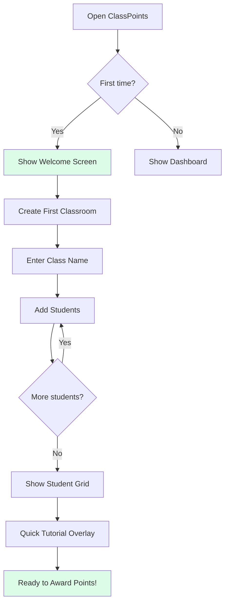
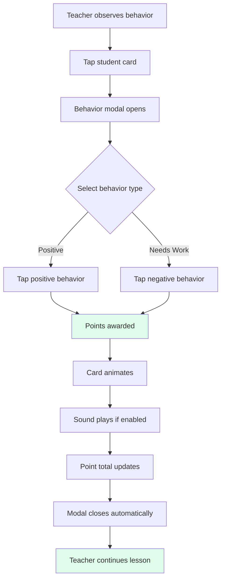
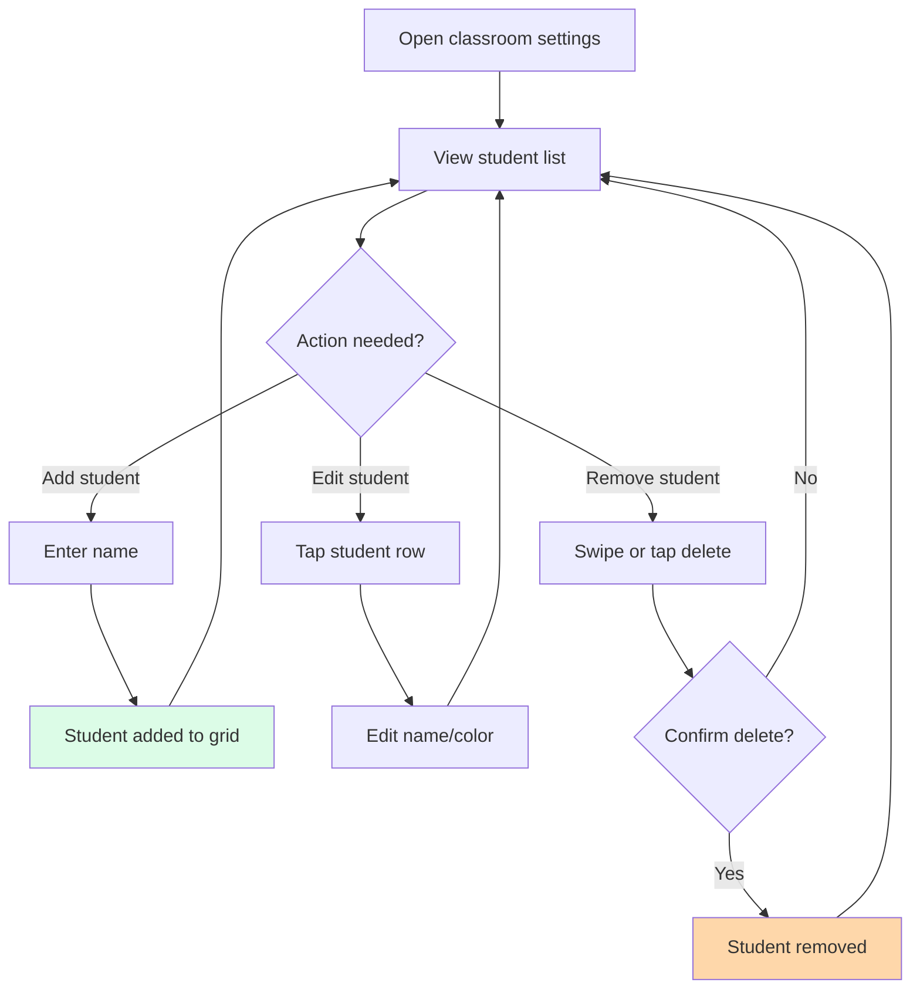
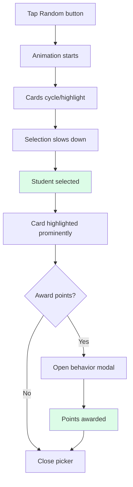

# UX Design Specification ClassPoints

**Author:** Sallvain
**Date:** 2025-12-13

---

## Executive Summary

### Project Vision

ClassPoints is a classroom behavior management web application designed for teachers to track and award student points in real-time during lessons. The app runs primarily on Smart Boards (large touch displays) in classroom settings, requiring a UI optimized for quick interactions, visibility from distance, and minimal disruption to teaching flow.

The application enables teachers to:

- Manage multiple classrooms with student rosters
- Award positive points for good behaviors (helping others, participation, following rules)
- Deduct points for behaviors that need work (off task, disruptive, late)
- View class-wide and individual student point totals
- Use gamification features like random student selection

### Target Users

**Primary User: Teachers**

- Use Smart Boards (large interactive touch displays) as the primary device
- Need to interact with the app during active lessons without losing classroom attention
- Tech-savviness varies from beginner to intermediate
- Value speed and simplicity over feature complexity
- Want visual feedback that students can see and respond to

**Secondary Stakeholders: Students**

- View the Smart Board display during class
- Respond to point awards as behavioral reinforcement
- May track their own progress (future consideration)

### Key Design Challenges

1. **Smart Board Optimization**
   - Touch targets must be large enough for reliable touch input
   - Text and icons must be readable from across a classroom (15-30 feet)
   - UI must work well on landscape-oriented large displays

2. **Speed of Interaction**
   - Teachers need to award points in 2-3 taps without losing lesson momentum
   - The modal-based behavior selection must be fast and intuitive
   - Frequent actions should require minimal cognitive load

3. **Visual Clarity for Audience**
   - Students watching the board should clearly see who received points
   - Color coding and icons help quick recognition
   - Animations/feedback should celebrate positive behaviors

4. **Polish and Reliability**
   - PRD mentions "UX jankiness" that needs addressing
   - Interactions should feel smooth and responsive
   - Error states should be clear and recoverable

### Design Opportunities

1. **Celebratory Feedback**
   - Animations when points are awarded could increase student engagement
   - Sound effects (already partially implemented) reinforce the reward system
   - Visual celebrations visible to the whole class

2. **Workflow Optimization**
   - Favorites or quick-access for most-used behaviors
   - Gesture shortcuts for power users
   - Keyboard shortcuts for teachers using mouse/keyboard instead of touch

3. **Student Engagement**
   - Leaderboards or progress visualizations students can see
   - Class goals and milestones
   - Random picker gamification (already implemented)

## Core User Experience

### Defining Experience

The core experience of ClassPoints centers on one primary interaction loop:

**Tap Student → Select Behavior → Points Awarded**

This 3-tap flow is the heartbeat of the application. Everything else supports this moment: classroom setup enables it, the student grid displays it, and the point totals reflect its cumulative effect. The entire UX must optimize for making this loop as fast, satisfying, and visible as possible.

### Platform Strategy

**Current Platforms:**

- **Smart Board** (primary) - Large touch display in classroom, visible to all students
- **Laptop** (secondary) - Teacher's desk for setup and review

**Future Platform:**

- **Mobile phones** - On-the-go point tracking, requiring responsive/adaptive design

**Platform Priorities:**

1. Smart Board touch optimization (large targets, classroom visibility)
2. Responsive design that scales from phone to large display
3. No offline requirement currently, but architecture should not preclude it

### Effortless Interactions

The following interactions should feel completely natural:

1. **Awarding points** - The primary loop must be completable in under 3 seconds
2. **Identifying students** - Color-coded avatars and names visible at a glance
3. **Understanding point status** - Positive/negative totals immediately clear
4. **Switching classrooms** - One tap in sidebar, instant context switch

### Critical Success Moments

Two moments define whether ClassPoints succeeds:

1. **First classroom setup** - Teacher creates classroom, adds students, and sees them appear. If this feels magical and quick, they'll keep using the app.

2. **First point award in class** - Teacher taps Emma, selects "Excellent Work +3", and the whole class sees Emma's card light up with a celebration. This is the moment students understand the system and become engaged.

### Experience Principles

These principles guide all UX decisions for ClassPoints:

1. **Speed Over Features** - Every interaction should be completable in minimal taps. If a feature adds friction to the core loop, reconsider it.

2. **Visible to the Classroom** - The UI is not just for the teacher; it's a display for 25+ students watching from their desks. Design for visibility.

3. **Celebration Matters** - Positive reinforcement is the product's purpose. Point awards should feel rewarding and visible to everyone.

4. **Touch-First, Responsive-Ready** - Optimize for large touch targets on Smart Boards, but ensure the design scales gracefully to smaller screens.

### User Mental Model

**How teachers currently solve this problem:**

- Paper-based systems (sticker charts, token boards) - visual but slow and manual
- Mental tracking - fast but unreliable and not visible to students
- ClassDojo - the market leader teachers are familiar with

**Mental model teachers bring:**

- "I tap the student, I pick what they did, it's recorded" (transactional, immediate)
- Points are public acknowledgment, not private grading
- The class sees everything in real-time

**Where confusion/frustration occurs in existing solutions:**

- Too many taps to award a single point
- Can't find the behavior they want quickly
- Interface is cluttered with features they don't use
- Animations/sounds that disrupt lesson flow

### Success Criteria

**Core experience success indicators:**

1. **Speed**: Award points in under 3 seconds (tap → select → done)
2. **Visibility**: Students can see their name light up from 20+ feet away
3. **Flow**: Teacher never loses eye contact with the class for more than 2 seconds
4. **Accuracy**: Points are recorded correctly 100% of the time
5. **Satisfaction**: The "ding" sound and visual feedback feel rewarding

**"It just works" moments:**

- Tap Emma → immediately see her card highlighted
- Pick "+3 Excellent Work" → see the +3 animate up on her card
- Return to teaching without missing a beat

### Pattern Analysis

**ClassPoints uses ESTABLISHED patterns:**

This is deliberately a ClassDojo clone, leveraging patterns that millions of teachers already understand:

| Pattern             | Origin    | ClassPoints Adoption                  |
| ------------------- | --------- | ------------------------------------- |
| Student grid        | ClassDojo | Direct adoption                       |
| Tap-to-award        | ClassDojo | Direct adoption                       |
| Behavior categories | ClassDojo | Direct adoption (Positive/Needs Work) |
| Sound feedback      | ClassDojo | Adopted with teacher control          |
| Point animation     | ClassDojo | Simplified, faster                    |

**Our unique twist within familiar patterns:**

- **Faster**: Stripped-down UI for quicker interactions
- **Simpler**: No messaging, portfolios, or parent features
- **Focused**: Just behavior tracking, done exceptionally well
- **Letter avatars**: Instead of monsters - faster to render, still personal

### Experience Mechanics

**The core loop broken down:**

**1. Initiation:**

- Teacher sees student doing something noteworthy
- Glances at Smart Board showing the student grid
- Taps the student's card (large touch target, colored avatar helps identification)

**2. Interaction:**

- Behavior modal appears immediately (no loading)
- Two columns: Positive (green) | Needs Work (orange)
- Each behavior shows: Icon + Name + Point value
- Teacher taps the appropriate behavior
- Modal closes automatically

**3. Feedback:**

- Student card briefly highlights/glows (400-600ms)
- Point value animates: "+3" floats up and fades
- Sound plays (if enabled): pleasant "ding" for positive, softer tone for negative
- Point total updates on the card

**4. Completion:**

- Card returns to normal state within 1 second
- Teacher's attention returns to class
- No confirmation needed, no additional taps
- Transaction is recorded to database in background

## Desired Emotional Response

### Primary Emotional Goals

ClassPoints serves two audiences simultaneously, each with distinct emotional needs:

**Teacher: IN CONTROL**

- The app should feel like a seamless extension of teaching, not a distraction
- Awarding points should be effortless, almost automatic
- Teachers should never fumble or lose classroom flow
- Confidence that the system is recording correctly and reliably

**Students: RECOGNIZED, PROUD, MOTIVATED, INSPIRED**

- **Recognized** - "The teacher noticed what I did"
- **Proud** - "I'm doing well, look at my points"
- **Motivated** - "I want to earn more points"
- **Inspired** - "I can do what my classmate did to earn points"

### Emotional Journey Mapping

| Stage           | Teacher Emotion        | Student Emotion                        |
| --------------- | ---------------------- | -------------------------------------- |
| Opening app     | Confident, ready       | Curious, attentive                     |
| Viewing class   | Organized, informed    | Aware of standing                      |
| Awarding points | Satisfied, efficient   | Recognized (recipient), Aware (others) |
| After award     | Uninterrupted, in flow | Proud (recipient), Motivated (others)  |
| End of class    | Accomplished           | Clear on their progress                |

### The Calibrated Celebration

The moment of point award requires careful emotional calibration:

**The Challenge:** Too little feedback and students don't notice; too much and every point becomes a classroom disruption.

**The Solution: Satisfying Acknowledgment**

- **Duration:** 0.5-1 second animation maximum
- **Visual:** Subtle highlight/glow on student card, point number animates up
- **Audio:** Brief, pleasant sound (optional, teacher-controlled)
- **Recovery:** Returns to normal state quickly so lesson continues

**Analogies:**

- Like an iPhone notification badge appearing - noticed but not demanding
- Like a "ding" sound in a game - satisfying without being theatrical
- Like a checkmark appearing - confirms action without fanfare

### Micro-Emotions

| Emotion                       | Support                                            | Avoid                                                 |
| ----------------------------- | -------------------------------------------------- | ----------------------------------------------------- |
| Confidence vs Confusion       | Clear icons, instant feedback, obvious tap targets | Ambiguous states, lag, hidden features                |
| Trust vs Skepticism           | Points update immediately, totals always accurate  | Delayed updates, math errors, lost data               |
| Accomplishment vs Frustration | Task completes in 2-3 taps, visible confirmation   | Extra steps, modal stacking, unclear paths            |
| Delight vs Overwhelm          | Subtle animations, pleasing sounds                 | Excessive motion, loud alerts, constant notifications |

### Emotional Design Principles

1. **Invisible When Working** - The best emotional state is when teachers don't notice the app at all; it just works as expected.

2. **Noticeable Without Disruptive** - Students should notice points being awarded, but the classroom shouldn't pause for each one.

3. **Cumulative Satisfaction** - Individual moments are subtle, but watching point totals grow over a week should feel significant.

4. **Fair and Transparent** - Students should understand the system. Mystery breeds resentment; clarity breeds motivation.

## UX Pattern Analysis & Inspiration

### Primary Inspiration: ClassDojo

ClassPoints is designed as a **ClassDojo clone**, following the established UX patterns of the market-leading classroom behavior management app. This provides a familiar experience for teachers who have used ClassDojo while offering a streamlined, focused alternative.

### Inspiring Products Analysis

**ClassDojo** - The primary inspiration and pattern source:

- **Core Strength:** Simple, intuitive point awarding with immediate visual/audio feedback
- **Onboarding:** Quick classroom setup, easy student roster management
- **Navigation:** Student grid as primary view, behaviors accessible via student tap
- **Delight:** Monster avatars, sound effects, celebratory animations
- **Visual Design:** Bright colors, playful illustrations, clear iconography

### Transferable UX Patterns

| Pattern                 | ClassDojo Implementation                      | ClassPoints Adoption                                           |
| ----------------------- | --------------------------------------------- | -------------------------------------------------------------- |
| **Monster Avatars**     | Customizable monster characters               | Simplified: Colored letter initials (faster, lower complexity) |
| **Point Awarding Flow** | Tap student → Select behavior → Points update | ✅ Direct adoption                                             |
| **Behavior Categories** | Customizable positive/negative skills         | ✅ Direct adoption ("Positive" / "Needs Work")                 |
| **Sound Feedback**      | Distinct sounds for point changes             | ✅ Adopted with teacher control                                |
| **Student Grid**        | Cards with avatar, name, points               | ✅ Direct adoption                                             |
| **Class Total**         | Aggregate view of class behavior              | ✅ Direct adoption                                             |
| **Random Picker**       | Gamification through random selection         | ✅ Direct adoption                                             |
| **Quick Actions**       | Award to whole class at once                  | ✅ Available via Class Total                                   |

### Anti-Patterns to Avoid

1. **Feature Bloat** - ClassDojo has expanded to include messaging, stories, portfolios, and more. ClassPoints stays focused on the core behavior tracking use case.

2. **Subscription Pressure** - Avoid aggressive upselling or paywalling basic features.

3. **Slow Performance** - The app must remain snappy. No loading spinners during the core award flow.

4. **Complex Onboarding** - Keep first-time setup under 2 minutes.

5. **Overwhelming Customization** - Offer sensible defaults. Don't require teachers to configure everything before using.

### Design Inspiration Strategy

**Adopt Directly:**

- Point awarding interaction flow (tap → select → confirm)
- Student grid layout with avatar/name/points
- Positive/negative behavior categorization
- Sound effects for feedback

**Adapt/Simplify:**

- Avatars: Use colored letter initials instead of monsters (simpler, faster to render, still personal)
- Customization: Provide good defaults, hide advanced options behind settings

**Deliberately Omit (for now):**

- Parent communication features
- Student portfolios
- Messaging/stories
- Complex reporting dashboards

**Focus Differentiator:**
ClassPoints aims to be a **faster, simpler, more focused** alternative to ClassDojo - the core behavior tracking experience without the feature creep.

## Design System

### Design System Choice: Tailwind CSS v4

**Decision:** ClassPoints uses **Tailwind CSS v4** as its primary design system and styling framework.

**Rationale:**

1. **Speed for an interaction-heavy tool** - The core workflow (awarding points, seeing feedback) must be fast and fluid, especially on Smart Boards during live instruction. Tailwind's utility-first approach minimizes context-switching and makes iteration on layout, spacing, and sizing quick.

2. **Consistent visual language via tokens** - ClassPoints requires consistent tokens (color, spacing, typography) more than a heavy component library. Tailwind encourages codifying these as design tokens in config and using them via utility classes.

3. **Responsiveness across platforms** - Tailwind's responsive variants (`sm:`, `md:`, `lg:`) map cleanly to Smart Board (large), laptop (medium), and future phone (small) displays.

4. **Future-proofing** - Config-driven tokens support future theming, accessibility upgrades, and age-group differentiation by modifying tokens rather than refactoring components.

### Smart Board Design Tokens

All design decisions center on **Smart Boards as the primary target** - large, touch-friendly UI optimized for 1-3 meter viewing distance and finger interaction.

#### Touch Targets

| Token       | Purpose                                           | Size    | Tailwind                   |
| ----------- | ------------------------------------------------- | ------- | -------------------------- |
| `touch-lg`  | Primary controls (student avatars, award buttons) | 56-64px | `h-14 w-14` to `h-16 w-16` |
| `touch-md`  | Secondary controls (filters, close buttons)       | 44-48px | `h-11 w-11` to `h-12 w-12` |
| `touch-gap` | Spacing between tappable items                    | 8-12px  | `gap-2` to `gap-3`         |

**Hit area principle:** Where visual elements are smaller (icon-only), wrap them in a container providing the full touch target size.

#### Typography Scale for Classroom Visibility

Text must be readable from the back of a typical classroom (3-7 meters).

| Token               | Purpose                                | Size    | Tailwind                 |
| ------------------- | -------------------------------------- | ------- | ------------------------ |
| `type-display`      | Page titles (class name)               | 32-40px | `text-2xl` to `text-3xl` |
| `type-heading`      | Section titles                         | 24-28px | `text-xl` to `text-2xl`  |
| `type-student-name` | Student names (primary reading target) | 20-24px | `text-lg` to `text-xl`   |
| `type-label`        | Supporting labels, pill text           | 16-18px | `text-base` to `text-lg` |

**Contrast & Weight:**

- Use `font-medium` (500) minimum for primary labels and student names
- Target WCAG AA contrast (4.5:1) for primary text; minimum 3:1 for very large text (≥24px)

### Spacing and Sizing

#### Student Tiles

| Token          | Purpose                      | Value                 | Tailwind                   |
| -------------- | ---------------------------- | --------------------- | -------------------------- |
| `tile-student` | Student card dimensions      | 140-180px × 120-160px | `w-36 h-32` to `w-44 h-40` |
| `grid-gap`     | Grid spacing between tiles   | 12-16px               | `gap-3` to `gap-4`         |
| `bar-height`   | Top/bottom control bars      | 64-80px               | `h-16` to `h-20`           |
| `safe-area`    | Edge margins for Smart Board | 24-32px               | `px-6` to `px-8`           |

#### Core Spacing Scale

| Token       | Value | Tailwind |
| ----------- | ----- | -------- |
| `space-xs`  | 4px   | `1`      |
| `space-sm`  | 8px   | `2`      |
| `space-md`  | 12px  | `3`      |
| `space-lg`  | 16px  | `4`      |
| `space-xl`  | 24px  | `6`      |
| `space-2xl` | 32px  | `8`      |

### Animation Guidelines ("Calibrated Celebration")

Feedback should be **immediately noticeable, short (0.5-1s), and non-disruptive**.

#### Duration & Timing

| Animation Type                       | Duration              | Timing                                        |
| ------------------------------------ | --------------------- | --------------------------------------------- |
| Celebratory feedback (point awarded) | 0.5-1.0 seconds total | `ease-out` or `cubic-bezier(0.16, 1, 0.3, 1)` |
| Micro-interactions (hover, tap)      | 150-250ms             | `ease-out`                                    |

**Celebration breakdown:**

- Entry animation: 200-300ms
- Hold/peak: 100-300ms
- Exit/fade: 200-400ms

#### Motion Patterns

**Allowed/Encouraged:**

- **Subtle scale & opacity:** Point badge scales 0.9 → 1.05 → 1.0 with fade
- **Short directional motion:** "+1" badge floats up 8-16px while fading out
- **Color pulse:** Student tile background tints brighter for 400-600ms, then returns

**Avoid/Restrict:**

- No full-screen flashes or high-frequency strobing
- No complex or looping animations during normal use
- Limit simultaneous celebrations (stagger or subdue when many trigger at once)

#### Specific Celebration Patterns

**Single Point Award:**

1. Student tile: Quick `scale-105` → `scale-100` over 250ms with background tint for 400-600ms
2. Point badge: Appears at 0.9 scale, grows to 1.0, moves up 8-16px while fading out over 400-700ms

**Class Milestone:**

1. Banner slides/fades in from top over 250-300ms
2. Holds visible for 700-1200ms
3. Fades out over 300-400ms
4. Reserve for clearly defined milestone triggers only

#### Motion Accessibility

- Provide app-level "Reduced Motion" preference (future enhancement)
- When enabled: Replace scale/move with simple opacity; reduce durations to 150-250ms
- No flickering above 3 Hz
- Throttle celebrations if many events fire in quick succession

## Visual Design Foundation

### Color System

ClassPoints uses a classroom-friendly color palette optimized for Smart Board visibility and emotional clarity.

#### Primary Colors

| Role         | Color       | Hex       | Usage                              |
| ------------ | ----------- | --------- | ---------------------------------- |
| Primary      | Bright Blue | `#4A90D9` | Primary actions, navigation, links |
| Primary Dark | Deep Blue   | `#2E5C8A` | Hover states, emphasis             |
| Background   | Soft White  | `#FAFBFC` | Main background                    |
| Surface      | Pure White  | `#FFFFFF` | Cards, modals, elevated surfaces   |

#### Semantic Colors

| Role           | Color         | Hex       | Usage                              |
| -------------- | ------------- | --------- | ---------------------------------- |
| Positive       | Vibrant Green | `#22C55E` | Positive behaviors, success states |
| Positive Light | Soft Green    | `#DCFCE7` | Positive backgrounds, highlights   |
| Negative       | Warm Orange   | `#F97316` | Needs Work behaviors, warnings     |
| Negative Light | Soft Orange   | `#FED7AA` | Negative backgrounds, highlights   |
| Error          | Alert Red     | `#EF4444` | Error states, destructive actions  |
| Neutral        | Slate Gray    | `#64748B` | Secondary text, borders            |

#### Student Avatar Colors

A curated palette of distinct, visually pleasing colors for student identification:

| Color Name | Hex       | Notes               |
| ---------- | --------- | ------------------- |
| Coral      | `#FF6B6B` | Warm, friendly      |
| Ocean      | `#4ECDC4` | Cool, calming       |
| Sunset     | `#FFE66D` | Bright, energetic   |
| Lavender   | `#9B59B6` | Playful, distinct   |
| Sky        | `#74B9FF` | Light, approachable |
| Mint       | `#00B894` | Fresh, positive     |
| Peach      | `#FD79A8` | Soft, warm          |
| Slate      | `#636E72` | Neutral, mature     |

#### Color Accessibility

- All text meets WCAG AA contrast (4.5:1 minimum)
- Interactive elements use 3:1 contrast against backgrounds
- Colors are not the only indicator of state (icons/text supplement)
- Tested for common color blindness types (deuteranopia, protanopia)

### Typography System

#### Font Stack

```css
/* Primary: System fonts for performance */
font-family:
  -apple-system, BlinkMacSystemFont, 'Segoe UI', Roboto, 'Helvetica Neue', Arial, sans-serif;

/* Alternative: Inter for refined appearance */
font-family: 'Inter', sans-serif;
```

**Rationale:** System fonts load instantly (critical for Smart Board startup) while providing excellent legibility at large sizes.

#### Type Scale (Smart Board Optimized)

| Level        | Size | Weight | Line Height | Use Case                   |
| ------------ | ---- | ------ | ----------- | -------------------------- |
| Display      | 40px | 700    | 1.1         | Classroom name, main title |
| H1           | 32px | 600    | 1.2         | Section headers            |
| H2           | 24px | 600    | 1.3         | Panel titles               |
| Student Name | 20px | 500    | 1.3         | Student cards (primary)    |
| Body         | 18px | 400    | 1.5         | General text               |
| Label        | 16px | 500    | 1.4         | Buttons, tags              |
| Caption      | 14px | 400    | 1.4         | Secondary info             |

#### Typography Guidelines

- **Minimum size on Smart Board:** 16px (smaller is unreadable from distance)
- **Student names:** Always 20px+ with medium weight for quick identification
- **Point values:** Bold, high contrast for instant recognition
- **Truncation:** Names over 12 characters may truncate with ellipsis

### Spacing & Layout Foundation

#### Base Unit

The spacing system uses **4px as the base unit** with a consistent scale:

| Token     | Value | Tailwind | Use Case                 |
| --------- | ----- | -------- | ------------------------ |
| `space-1` | 4px   | `1`      | Icon gaps, tight spacing |
| `space-2` | 8px   | `2`      | Small internal padding   |
| `space-3` | 12px  | `3`      | Standard gaps            |
| `space-4` | 16px  | `4`      | Card padding             |
| `space-6` | 24px  | `6`      | Section spacing          |
| `space-8` | 32px  | `8`      | Major section breaks     |

#### Layout Principles

1. **Density: Medium-High**
   - Student grid should show 20-30 students without scrolling
   - Controls should be visible without searching
   - White space prevents visual clutter but doesn't waste screen real estate

2. **Grid System**
   - Student grid: CSS Grid with `auto-fill` and `minmax(140px, 1fr)`
   - Sidebar: Fixed 280px width on large screens
   - Main content: Fluid, fills remaining space

3. **Visual Hierarchy**
   - Class name: Top, largest element
   - Student grid: Center, majority of screen
   - Controls: Bottom or sidebar, easily accessible but not dominant
   - Point totals: On each card, immediately visible

### Accessibility Considerations

#### Visual Accessibility

| Requirement      | Implementation                                   |
| ---------------- | ------------------------------------------------ |
| Color contrast   | All text 4.5:1+ against background               |
| Focus indicators | 2px solid outline, high contrast                 |
| Touch targets    | Minimum 44px × 44px (larger for primary actions) |
| Text scaling     | UI remains usable at 150% zoom                   |

#### Motion Accessibility

| Requirement        | Implementation                               |
| ------------------ | -------------------------------------------- |
| Reduced motion     | Respect `prefers-reduced-motion` media query |
| Animation duration | All animations under 1 second                |
| No auto-play       | Animations triggered by user action only     |
| No flickering      | Nothing flashes more than 3x per second      |

#### Cognitive Accessibility

| Requirement           | Implementation                         |
| --------------------- | -------------------------------------- |
| Consistent navigation | Same layout across all views           |
| Clear labeling        | All icons have text labels or tooltips |
| Predictable behavior  | Actions do what users expect           |
| Error prevention      | Confirmations for destructive actions  |

#### Future Considerations

- High contrast mode (black/white/yellow palette)
- Large text mode (150% scale preset)
- Screen reader announcements for point awards
- Keyboard navigation for laptop/desktop use

## Design Direction Decision

### Design Directions Explored

As a **ClassDojo clone**, ClassPoints intentionally follows the established design direction of the market leader rather than exploring novel alternatives. This provides:

1. **Familiar UX** - Teachers who've used ClassDojo will instantly understand ClassPoints
2. **Proven patterns** - ClassDojo's design has been refined over years with millions of users
3. **Reduced risk** - No need to validate novel design decisions
4. **Faster development** - Clear direction without extensive prototyping

### Chosen Direction: ClassDojo-Inspired, Simplified

**Core Visual Approach:**

| Aspect     | ClassDojo                 | ClassPoints Adaptation                    |
| ---------- | ------------------------- | ----------------------------------------- |
| Layout     | Student grid with sidebar | Same: Grid-centric with controls          |
| Avatars    | Monster characters        | Simplified: Colored letter initials       |
| Colors     | Bright, playful palette   | Similar: Green positive, orange negative  |
| Animations | Celebratory, engaging     | Calibrated: Noticeable but not disruptive |
| Density    | Medium                    | Slightly higher: Fit more students        |

**Visual Style Keywords:**

- **Playful but professional** - Appropriate for classroom, not childish
- **Clean and uncluttered** - Focus on students, not chrome
- **Bright and encouraging** - Positive reinforcement through color
- **Large and readable** - Optimized for Smart Board distance

### Design Rationale

**Why follow ClassDojo rather than innovate:**

1. **User expectation alignment** - Teachers expect behavior apps to work like ClassDojo
2. **Reduced cognitive load** - No learning curve for switching users
3. **Focused differentiation** - Compete on speed/simplicity, not novel UI
4. **Risk mitigation** - Unproven design patterns could fail in classroom

**Where we differentiate:**

1. **Speed** - Fewer features = faster interactions
2. **Simplicity** - Letter avatars instead of monster customization
3. **Focus** - No messaging, portfolios, or parent features
4. **Performance** - Optimized for Smart Board hardware

### Implementation Approach

**Phase 1: Core Experience (Current)**

- Student grid with tap-to-award flow
- Behavior modal with positive/negative categories
- Sound feedback system
- Basic animations

**Phase 2: Polish & Refinement**

- Celebration animations (calibrated)
- Point animations (floating +/- badges)
- Loading state refinements
- Error state improvements

**Phase 3: Enhancements**

- Class milestones and celebrations
- Leaderboard views
- History and undo improvements
- Keyboard shortcuts for power users

### Design System Implementation

The visual foundation documented above translates to implementation as follows:

```
Tailwind Configuration → Component Library → Page Templates
     ↓                        ↓                    ↓
Color tokens            StudentCard           ClassroomView
Typography scale        BehaviorModal         DashboardView
Spacing tokens          Header/Sidebar        SettingsView
Animation classes       PointBadge            OnboardingFlow
```

All components reference the design tokens, ensuring visual consistency across the application.

## User Journey Flows

### Journey 1: First-Time Classroom Setup

**Goal:** Teacher creates their first classroom and adds students so they can start using ClassPoints.

**Success Criteria:**

- Complete setup in under 2 minutes
- Feel confident the system is ready to use
- Understand the basic workflow



**Key UX Decisions:**

- Skip account creation friction - start with classroom setup immediately
- Batch student entry (paste names or add one-by-one)
- Auto-assign avatar colors for visual distinction
- Show tutorial overlay on first view of student grid

### Journey 2: Point Awarding (Core Loop)

**Goal:** Teacher awards points to a student for observed behavior in under 3 seconds.

**Success Criteria:**

- 3 taps or fewer from intent to completion
- Visual feedback visible to entire classroom
- No interruption to teaching flow



**Key UX Decisions:**

- Modal appears instantly (no loading)
- Large touch targets for reliable selection
- Auto-close after selection (no confirm button)
- Animation duration calibrated for visibility without disruption

### Journey 3: Classroom Management

**Goal:** Teacher manages student roster (add, edit, remove students).



**Key UX Decisions:**

- Confirmation required only for destructive actions (delete)
- Inline editing for quick name changes
- Avatar color selection via color picker
- Deleted students can be recovered (soft delete)

### Journey 4: Using Random Picker

**Goal:** Teacher selects a random student for participation using gamification.



**Key UX Decisions:**

- Dramatic animation builds suspense (classroom engagement)
- Selected student highlighted prominently for all to see
- Optional immediate follow-up with point award
- Can be re-triggered for multiple selections

### Journey Patterns

**Navigation Patterns:**
| Pattern | Usage | Implementation |
|---------|-------|----------------|
| Modal overlay | Point awarding, confirmations | Centered, backdrop blur |
| Sidebar panel | Settings, classroom list | Slide from left, 280px |
| Inline editing | Student name changes | Click-to-edit pattern |

**Decision Patterns:**
| Pattern | Usage | Implementation |
|---------|-------|----------------|
| Two-column choice | Positive vs. Needs Work | Side-by-side, color-coded |
| Destructive confirm | Delete student/classroom | Red button, explicit action |
| Auto-proceed | Point awarded | No confirm needed |

**Feedback Patterns:**
| Pattern | Usage | Implementation |
|---------|-------|----------------|
| Card animation | Point awarded | Scale + glow + fade |
| Sound effect | Point awarded | Optional, teacher-controlled |
| Toast notification | System messages | Bottom-center, auto-dismiss |
| Loading state | Data operations | Skeleton or spinner |

### Flow Optimization Principles

1. **Minimize Path to Value**
   - First-time setup: 4 screens maximum
   - Point awarding: 3 taps maximum
   - Classroom switching: 1 tap

2. **Progressive Disclosure**
   - Show only essential options initially
   - Advanced settings hidden behind gear icon
   - Custom behaviors in settings, not main flow

3. **Error Prevention Over Recovery**
   - Disable invalid actions rather than showing errors
   - Confirm only destructive, irreversible actions
   - Auto-save all changes immediately

4. **Contextual Actions**
   - Actions appear where relevant (on student cards)
   - No need to navigate to separate screens
   - Long-press for additional options (future)

## Component Strategy

### Design System Coverage

**Tailwind CSS provides:**

- Typography utilities (text-_, font-_)
- Color utilities (bg-_, text-_, border-\*)
- Spacing utilities (p-_, m-_, gap-\*)
- Layout utilities (flex, grid, responsive variants)
- Animation utilities (transition-_, animate-_)

**Custom components needed for ClassPoints:**
| Component | Purpose | Priority |
|-----------|---------|----------|
| StudentCard | Display student with avatar, name, points | Critical |
| BehaviorModal | Two-column behavior selection | Critical |
| PointBadge | Animated floating point indicator | Critical |
| ClassroomSelector | Sidebar list of classrooms | High |
| Header | App title, settings, logout | High |
| RandomPicker | Animated random student selection | Medium |
| HistoryPanel | Point transaction history | Medium |
| SettingsPanel | User preferences, sound toggle | Medium |

### Custom Component Specifications

#### StudentCard

**Purpose:** Display a single student in the grid with quick access to point awarding.

**Anatomy:**

```
┌─────────────────────────┐
│  ┌───┐                  │
│  │ E │  Emma            │
│  └───┘  ───────         │
│         +12 points      │
└─────────────────────────┘
```

**States:**
| State | Visual Treatment |
|-------|------------------|
| Default | White background, subtle border |
| Hover | Elevated shadow, scale 1.02 |
| Active/Pressed | Scale 0.98, darker background |
| Highlighted | Green/orange glow based on last action |
| Selected (Random) | Prominent border, pulsing animation |

**Variants:**

- Size: Small (100px), Medium (140px), Large (180px)
- Density controlled by user toggle

#### BehaviorModal

**Purpose:** Present behavior options after student tap.

**Anatomy:**

```
┌───────────────────────────────────────┐
│              Emma                    ✕│
├───────────────────┬───────────────────┤
│    POSITIVE       │    NEEDS WORK     │
│  ───────────────  │  ───────────────  │
│  😊 Helpful +1    │  😐 Off Task -1   │
│  🌟 Great Work +2 │  🔇 Disruptive -1 │
│  ⭐ Excellent +3  │  ⏰ Late -1       │
│  💪 Participation │  📱 Distracted -1 │
└───────────────────┴───────────────────┘
```

**States:**
| State | Visual Treatment |
|-------|------------------|
| Opening | Fade in + scale from 0.95 |
| Behavior hover | Highlight row, show selection cursor |
| Behavior active | Press effect, immediate feedback |
| Closing | Fade out, auto-closes after selection |

#### PointBadge

**Purpose:** Animated indicator showing points awarded.

**Animation Sequence:**

1. Appears at student card location (opacity 0 → 1, scale 0.9 → 1.05)
2. Holds briefly (100-200ms)
3. Floats upward 16px while fading (opacity 1 → 0)
4. Total duration: 500-700ms

**Variants:**

- Positive: Green text, "+N" format
- Negative: Orange text, "-N" format

### Component Implementation Guidelines

**Build Order:**

1. StudentCard (blocks all other work)
2. BehaviorModal (core loop completion)
3. PointBadge (feedback polish)
4. Header/ClassroomSelector (navigation)
5. RandomPicker (gamification)
6. Settings/History (secondary features)

**Composition Strategy:**

- Components are pure presentational where possible
- State managed by parent contexts (useApp hook)
- Props for variants, callbacks for actions
- Tailwind for styling, no CSS-in-JS

## UX Consistency Patterns

### Button Patterns

**Button Hierarchy:**
| Type | Usage | Style |
|------|-------|-------|
| Primary | Main action (Create, Save) | Solid blue, white text |
| Secondary | Alternative action (Cancel) | Outlined, blue text |
| Danger | Destructive action (Delete) | Solid red, white text |
| Ghost | Tertiary action (Learn More) | Text only, hover underline |

**Button States:**
| State | Visual | Cursor |
|-------|--------|--------|
| Default | Full opacity | Pointer |
| Hover | Slightly darker/lighter | Pointer |
| Active | Scale 0.98, darker | Pointer |
| Disabled | 50% opacity | Not-allowed |
| Loading | Spinner, disabled state | Wait |

### Feedback Patterns

**Toast Notifications:**
| Type | Color | Icon | Duration |
|------|-------|------|----------|
| Success | Green | ✓ | 3 seconds |
| Error | Red | ✕ | 5 seconds (or dismiss) |
| Warning | Orange | ⚠ | 5 seconds |
| Info | Blue | ℹ | 3 seconds |

**Placement:** Bottom-center, stacked if multiple.

**In-Line Feedback:**

- Form errors: Red text below field, red border
- Success states: Green checkmark, green border
- Loading states: Skeleton shimmer or spinner

### Empty States

| Context         | Message                                      | Action                    |
| --------------- | -------------------------------------------- | ------------------------- |
| No classrooms   | "Create your first classroom to get started" | "Create Classroom" button |
| No students     | "Add students to start tracking behavior"    | "Add Students" button     |
| No points today | "No points awarded yet today"                | None (informational)      |
| No history      | "Point history will appear here"             | None (informational)      |

### Loading States

| Context            | Pattern                        |
| ------------------ | ------------------------------ |
| Initial load       | Full-screen skeleton           |
| Data refresh       | Subtle spinner in header       |
| Action in progress | Button spinner + disabled      |
| Long operation     | Progress bar (if determinable) |

### Modal Patterns

**Modal Types:**
| Type | Usage | Close Method |
|------|-------|--------------|
| Behavior selection | Point awarding | Auto-close on select, X button, backdrop click |
| Confirmation | Delete actions | Yes/No buttons, X button |
| Settings | Configuration | Save/Cancel buttons, X button |
| Alert | Error messages | OK button, X button |

## Responsive Design Strategy

### Platform Priority

ClassPoints is **Smart Board-first**, with graceful degradation:

| Platform                | Priority  | Optimization                                |
| ----------------------- | --------- | ------------------------------------------- |
| Smart Board (1920×1080) | Primary   | Largest touch targets, classroom visibility |
| Laptop (1366×768)       | Secondary | Full functionality, mouse/keyboard support  |
| Tablet (1024×768)       | Tertiary  | Touch optimized, simplified layout          |
| Phone (375×667)         | Future    | Basic functionality, responsive grid        |

### Breakpoint Strategy

**Custom breakpoints for classroom use:**

| Breakpoint | Name               | Target                        |
| ---------- | ------------------ | ----------------------------- |
| ≥1280px    | `sb` (Smart Board) | Full layout, large targets    |
| ≥1024px    | `lg` (Laptop)      | Full layout, standard targets |
| ≥768px     | `md` (Tablet)      | Simplified layout             |
| <768px     | `sm` (Phone)       | Single column, bottom nav     |

### Responsive Adaptations

**Student Grid:**
| Breakpoint | Behavior |
|------------|----------|
| Smart Board | 6-8 columns, large cards |
| Laptop | 4-6 columns, medium cards |
| Tablet | 3-4 columns, medium cards |
| Phone | 2 columns, small cards |

**Navigation:**
| Breakpoint | Behavior |
|------------|----------|
| Smart Board | Persistent sidebar |
| Laptop | Collapsible sidebar |
| Tablet | Hamburger menu → drawer |
| Phone | Bottom navigation bar |

**Behavior Modal:**
| Breakpoint | Behavior |
|------------|----------|
| Smart Board | Two-column, centered |
| Laptop | Two-column, centered |
| Tablet | Two-column, full width |
| Phone | Single column, bottom sheet |

## Accessibility Strategy

### WCAG Compliance Target

**Level:** WCAG 2.1 AA compliance (required for educational software).

### Accessibility Requirements

**Perceivable:**

- [ ] All images have alt text
- [ ] Color is not the only indicator of meaning
- [ ] Text contrast ≥4.5:1 (body), ≥3:1 (large text)
- [ ] UI scalable to 200% without loss of functionality

**Operable:**

- [ ] All functions keyboard accessible
- [ ] Focus indicators visible (2px outline)
- [ ] Touch targets ≥44px
- [ ] No time-dependent interactions (except animations)
- [ ] Skip navigation link available

**Understandable:**

- [ ] Language declared in HTML
- [ ] Form labels associated with inputs
- [ ] Error messages descriptive and helpful
- [ ] Consistent navigation patterns

**Robust:**

- [ ] Valid HTML structure
- [ ] ARIA landmarks and labels where appropriate
- [ ] Works with screen readers (VoiceOver, NVDA)

### Keyboard Navigation

| Key         | Action                                   |
| ----------- | ---------------------------------------- |
| Tab         | Move to next interactive element         |
| Shift+Tab   | Move to previous element                 |
| Enter/Space | Activate focused element                 |
| Escape      | Close modal/overlay                      |
| Arrow keys  | Navigate within components (grid, modal) |

### Screen Reader Support

**Announcements:**

- Point awarded: "Emma received 3 points for Excellent Work"
- Student selected (Random): "Emma has been selected"
- Error: "Error: Could not save changes. Please try again."

**Landmarks:**

- `<header>` - App header
- `<nav>` - Classroom navigation
- `<main>` - Student grid
- `<aside>` - Settings panel

---

## Document Summary

This UX Design Specification provides a comprehensive guide for implementing ClassPoints as a ClassDojo-inspired classroom behavior management application optimized for Smart Boards.

**Key Design Decisions:**

1. **ClassDojo clone approach** - Leverage proven patterns, differentiate on speed/simplicity
2. **Smart Board optimization** - Large touch targets, classroom-visible feedback
3. **Calibrated celebrations** - Noticeable but not disruptive (0.5-1s animations)
4. **Tailwind CSS v4** - Utility-first styling with design tokens
5. **Teacher in control, students engaged** - Dual-audience emotional design

**Implementation Priorities:**

1. Core loop (tap → select → award)
2. Student grid with proper sizing
3. Behavior modal with instant response
4. Point animations and feedback
5. Sound effects and celebrations

**Next Steps:**

- Architecture design (if not already complete)
- Epic and story generation for implementation
- Component development following this specification
- User testing with teachers on actual Smart Boards
