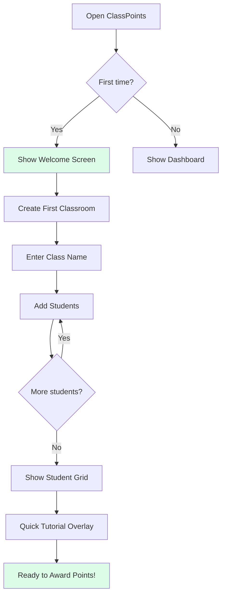
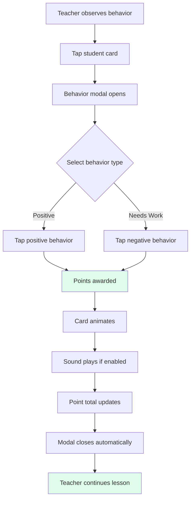
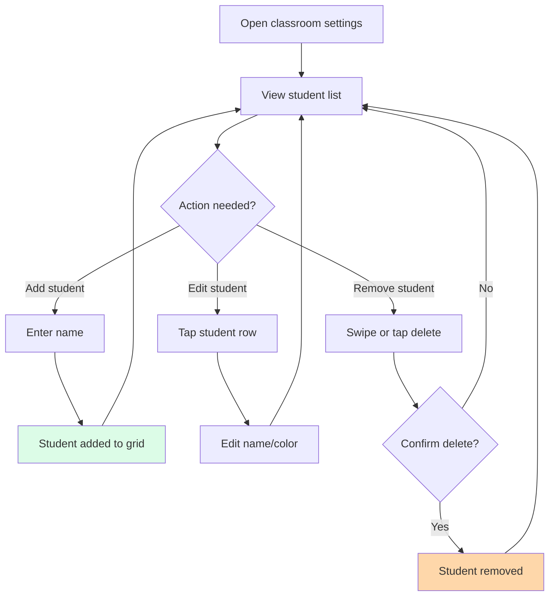
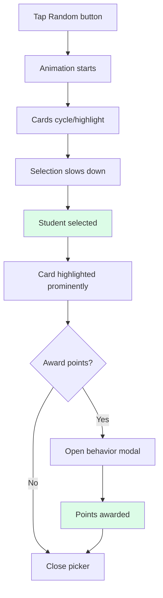

# User Journey Flows

## Journey 1: First-Time Classroom Setup

**Goal:** Teacher creates their first classroom and adds students so they can start using ClassPoints.

**Success Criteria:**

- Complete setup in under 2 minutes
- Feel confident the system is ready to use
- Understand the basic workflow

**Key UX Decisions:**

- Skip account creation friction - start with classroom setup immediately
- Batch student entry (paste names or add one-by-one)
- Auto-assign avatar colors for visual distinction
- Show tutorial overlay on first view of student grid

## Journey 2: Point Awarding (Core Loop)

**Goal:** Teacher awards points to a student for observed behavior in under 3 seconds.

**Success Criteria:**

- 3 taps or fewer from intent to completion
- Visual feedback visible to entire classroom
- No interruption to teaching flow

**Key UX Decisions:**

- Modal appears instantly (no loading)
- Large touch targets for reliable selection
- Auto-close after selection (no confirm button)
- Animation duration calibrated for visibility without disruption

## Journey 3: Classroom Management

**Goal:** Teacher manages student roster (add, edit, remove students).

**Key UX Decisions:**

- Confirmation required only for destructive actions (delete)
- Inline editing for quick name changes
- Avatar color selection via color picker
- Deleted students can be recovered (soft delete)

## Journey 4: Using Random Picker

**Goal:** Teacher selects a random student for participation using gamification.

**Key UX Decisions:**

- Dramatic animation builds suspense (classroom engagement)
- Selected student highlighted prominently for all to see
- Optional immediate follow-up with point award
- Can be re-triggered for multiple selections

## Journey Patterns

**Navigation Patterns:**
| Pattern | Usage | Implementation |
|---------|-------|----------------|
| Modal overlay | Point awarding, confirmations | Centered, backdrop blur |
| Sidebar panel | Settings, classroom list | Slide from left, 280px |
| Inline editing | Student name changes | Click-to-edit pattern |

**Decision Patterns:**
| Pattern | Usage | Implementation |
|---------|-------|----------------|
| Two-column choice | Positive vs. Needs Work | Side-by-side, color-coded |
| Destructive confirm | Delete student/classroom | Red button, explicit action |
| Auto-proceed | Point awarded | No confirm needed |

**Feedback Patterns:**
| Pattern | Usage | Implementation |
|---------|-------|----------------|
| Card animation | Point awarded | Scale + glow + fade |
| Sound effect | Point awarded | Optional, teacher-controlled |
| Toast notification | System messages | Bottom-center, auto-dismiss |
| Loading state | Data operations | Skeleton or spinner |

## Flow Optimization Principles

1. **Minimize Path to Value**
   - First-time setup: 4 screens maximum
   - Point awarding: 3 taps maximum
   - Classroom switching: 1 tap

2. **Progressive Disclosure**
   - Show only essential options initially
   - Advanced settings hidden behind gear icon
   - Custom behaviors in settings, not main flow

3. **Error Prevention Over Recovery**
   - Disable invalid actions rather than showing errors
   - Confirm only destructive, irreversible actions
   - Auto-save all changes immediately

4. **Contextual Actions**
   - Actions appear where relevant (on student cards)
   - No need to navigate to separate screens
   - Long-press for additional options (future)
